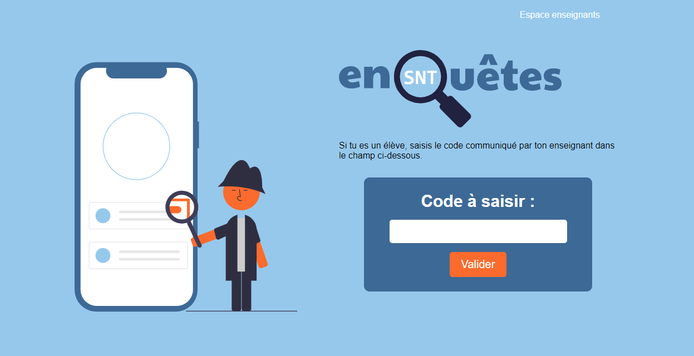
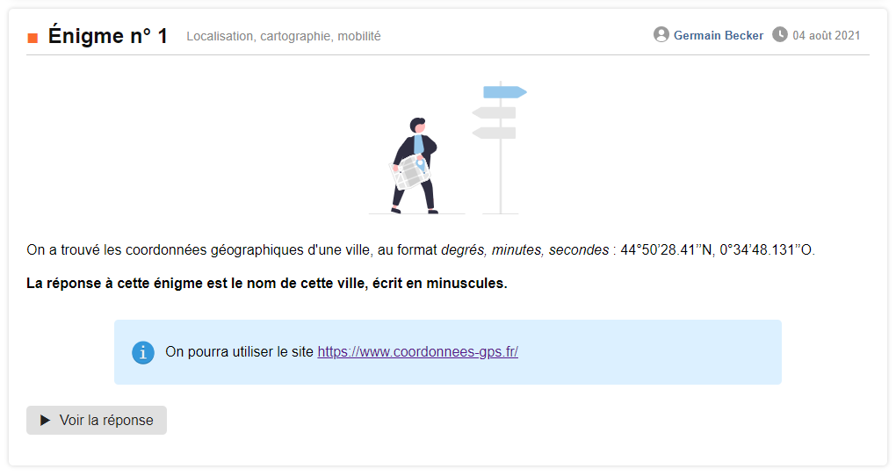
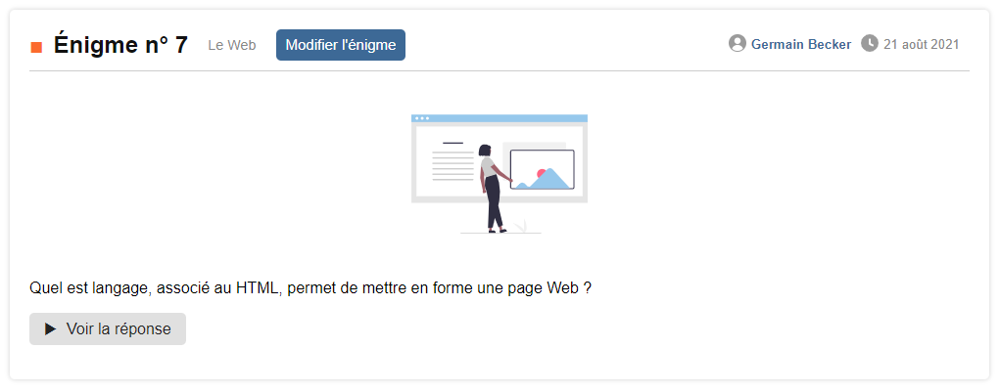
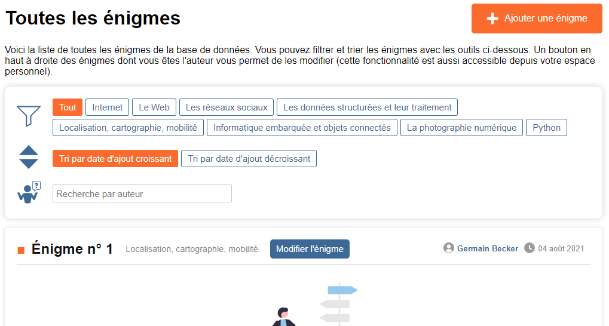
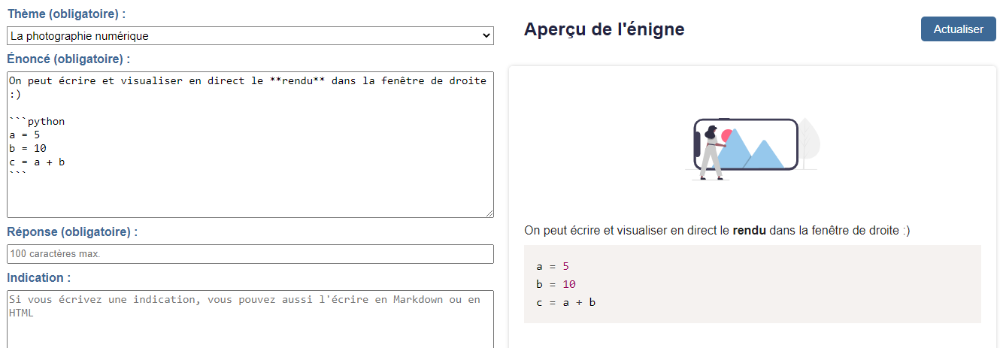
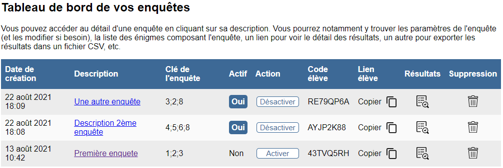
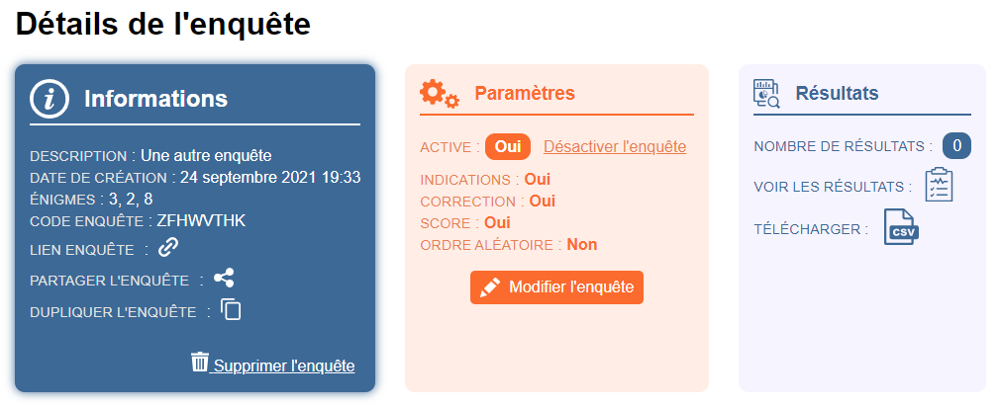
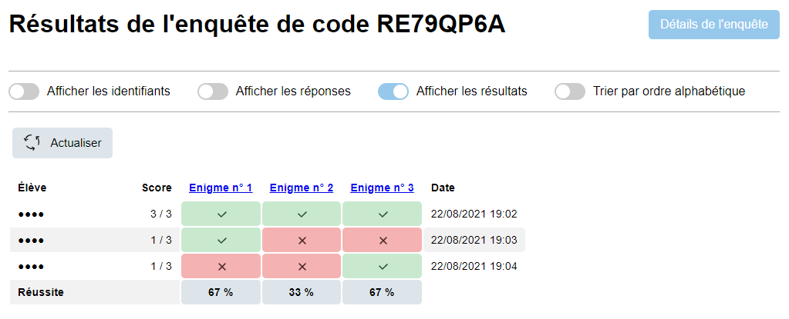

# enquetes-snt

L'application **enquetes-snt** permet aux enseignants de SNT (Sciences Numériques et Technologie) de créer, mutualiser et partager des énigmes à destination de leurs élèves.

Il s'agit d'une application Django développée par Germain Becker, enseignant de Mathématiques, NSI et SNT. Celle-ci est disponible à l'adresse : [enquetes-snt.fr](https://www.enquetes-snt.fr)

Cette application est diffusée sous licence [Creative Commons BY-NC-SA 4.0](https://creativecommons.org/licenses/by-nc-sa/4.0/deed.fr).

---

Concrètement, chaque enseignant peut se créer un compte sur la plateforme et peut ensuite :

* créer des énigmes qui seront ajoutées à la base commune
* créer ses propres enquêtes à partir d'une ou plusieurs énigmes de la base
* proposer ses enquêtes à ses élèves et récupérer leurs résultats

Ce document est une présentation de l'application.

**Table des matières**

* [Création d'un compte enseignant](#cr%C3%A9ation-dun-compte-enseignant)
* [Énigmes](#%C3%A9nigmes)
    * [Qu'est-ce qu'une *énigme* ?](#quest-ce-quune-%C3%A9nigme)
    * [Ajout d'une énigme](#ajout-dune-%C3%A9nigme)
* [Enquêtes](#enqu%C3%AAtes)
    * [Qu'est-ce qu'une enquête ?](#quest-ce-quune-enqu%C3%AAte)
    * [Création d'une enquête](#cr%C3%A9ation-dune-enqu%C3%AAte)
    * [Tableau de bord](#tableau-de-bord)
    * [Détails d'une enquête](#d%C3%A9tails-dune-enqu%C3%AAte)
    * [Résultats d'une enquête](#r%C3%A9sultats-dune-enqu%C3%AAte)
* [Côté elève](#c%C3%B4t%C3%A9-%C3%A9l%C3%A8ve)
  * [Accès à une enquête](#acc%C3%A8s-%C3%A0-une-enqu%C3%AAte)
  * [Résolution de l'enquête](#r%C3%A9solution-de-lenqu%C3%AAte)
  * [Score et correction](#score-et-correction)
* [Un mot de l'auteur](#mot-de-lauteur)
* [Participer à la cagnotte](#participer-%C3%A0-la-cagnotte)

---

# Création d'un compte enseignant

La page d'accueil [enquetes-snt.fr](https://www.enquetes-snt.fr) est à destination des élèves. On y trouve en haut à droite un lien pour accéder à l'espace enseignant où les enseignants peuvent s'identifier.

Pour accéder à l'application, un enseignant devra créer un compte à la première connexion en renseignant :

* un nom et un prénom (seront visibles uniquement des enseignants et permettront de filtrer les recherches d'énigmes par nom d'auteur)
* un nom d'utilisateur
* une adresse email (⚠️ seules les **adresses e-mail académiques** sont acceptées afin de garantir l'accès aux enseignants uniquement).
* un mot de passe évidemment

Chaque enseignant sera ensuite identifié grâce au couple (adresse e-mail, mot de passe).

> Les formats acceptés d'adresse e-mail sont du type _prenom.nom@ac-&lt;academie&gt;.&lt;domaine&gt;_. Pour les cas particuliers, vous pouvez me contacter.

Pour créer un compte, il est nécessaire de valider et accepter les conditions générales d'utilisation et la politique de confidentialité de l'application, disponibles à l'adresse [https://www.enquetes-snt.fr/conditions/](https://www.enquetes-snt.fr/conditions/)

**Quelques mots sur la confidentialité** 

L'application respecte le Réglement Général sur la Protection des Données (RGPD).

Seules des données nécessaires au fonctionnement de l'application sont collectées sur les utilisateurs (les enseignants qui se créent un compte) : nom, prénom, nom d'utilisateur, adresse e-mail, mot de passe. 

Les données collectées sont stockées de manière sécurisée et conforme au RGPD sur les serveurs européens de l'entreprise [PythonAnywhere](https://eu.pythonanywhere.com/), ces serveurs étant situés à Francfort (Allemagne) dans un centre de données d'Amazon Web Services.

Seuls des cookies nécessaires à la connexion des utilisateurs et à l'utilisation de l'application sont utilisés.

**Aucune donnée personnelle n'est collectée sur les élèves.**

>Vous trouverez davantage de détails en allant voir la politique de confidentialité dont le lien est donné un peu plus haut.

# Énigmes

## Qu'est-ce qu'une *énigme* ?

À l'origine, l'idée était de proposer aux élèves des énigmes nécessitant un travail de recherche de leur part (d'où les termes _énigme_ et _enquête_), afin de valider leurs connaissances et compétences. 

|  | 
|:--:| 
| *Une énigme* |

Mais tout est possible ! On peut également imaginer des énigmes comme des questions rapides plus classiques.

|  | 
|:--:| 
| *Une autre énigme* |

Libre à vous de vous approprier l'application comme vous le souhaitez, aussi bien dans les énigmes créées que dans l'utilisation avec vos élèves.

> D'autres énigmes sont déjà disponibles dans la base de données, elles pourront vous donner des idées 😀

Chaque énigme devra être associée à l'un des thèmes suivants :

* Internet
* Le Web
* Les réseaux sociaux
* Les données structurées et leur traitement
* Localisation, cartographie, mobilité
* Informatique embarquée et objets connectés
* La photographie numérique
* Python (qui est finalement un thème à part dans l'application)

> Si une énigme s'appuie sur plusieurs de ces thèmes, il faut choisir l'un d'entre eux, le plus cohérent/évident.
> Il est possible de filtrer les énigmes par thème et/ou par auteur.

|  | 
|:--:| 
| *Filtrer les énigmes* |

**⚠️ Remarques importantes sur les énigmes**

* la réponse à une énigme est **unique** et nécessairement **de type texte**, donc de préférence un **mot unique ou un code** qui devra être **bien orthographié**. 
* Un traitement est néanmoins prévu pour nettoyer les réponses afin de comparer celles saisies par les élèves à celle attendue : passage en minuscules, suppression des accents et des espaces inutiles en début et fin. Ainsi, si la réponse attendue (saisie par l'auteur de l'énigme) est la chaîne de caractères `"Orléans"` et qu'un élève saisit `"orleans "`, sa réponse sera jugée correcte. En revanche, s'il répond `"Orléan"`, elle sera incorrecte.
* les énigmes ne peuvent pas être des questions de type Vrai/Faux, QCM, associations, texte à trous, etc.

## Ajout d'une énigme

Le lien suivant, que vous trouverez également sur la page de création d'une énigme, donne des explications détaillées sur la création d'une énigme : [https://www.enquetes-snt.fr/enigme/creation/exemple/](https://www.enquetes-snt.fr/enigme/creation/exemple/).

Très rapidement, une énigme est composée de 6 champs :

1. Thème (obligatoire) : pour sélectionner le thème de l'énigme (l'un des 8 cités au-dessus)
2. Énoncé (obligatoire) : pour saisir l'énoncé de l'énigme
3. Réponse (obligatoire) : pour saisir la réponse à l'énigme
4. Indication (optionnel) : pour saisir une indication à destination des élèves (l'affichage des indications pourra être activée ou désactivée dans les paramètres d'une enquête)
5. Image d'illustration (optionnel) : pour téléverser une image pour accompagner l'énigme
6. Fichier en pièce jointe (optionnel) : pour téléverser une pièce jointe à l'énigme qui pourra être téléchargée par les élèves

Sachez que les énoncés et indications peuvent être rédigées en **Markdown** ou en **HTML**. Une zone vous permet de visualiser en direct le rendu de votre énigme.

|  | 
|:--:| 
| *Création d'une énigme* |

> Même si c'est sans doute moins utile, il est également possible d'utiliser LaTeX (via la bibliothèque MathJax dont le script est téléchargé par le navigateur automatiquement). La visualisation ne se fait pas en direct mais lorsque l'on quitte un champ de saisie ou si on clique sur le bouton _Actualiser_.

# Enquêtes

## Qu'est-ce qu'une *enquête* ?

Une enquête est formée d'au moins une énigme de la base. On peut donc créer des enquêtes plus ou moins longues.

## Création d'une enquête

Il y a deux façons de créer une enquête :

1. en sélectionnant les énigmes souhaitées en parcourant la liste d'énigmes
2. en renseignant directement la liste des numéros des énigmes souhaitées

Une enquête créée est par défaut **active**, c'est-à-dire qu'elle est disponible pour les élèves. Vous pouvez désactiver une enquête, elle ne sera alors plus accessible pour les élèves.

Au moment de la création d'une enquête, il faudra :

* renseigner une **description de l'enquête** (à destination uniquement de l'enseignant). Cette description peut contenir le nom de la classe ou du groupe concerné, le(s) thème(s) de l'enquête, etc. Cette description permettra de mieux vous y retrouver.
* définir les 4 paramètres suivants :
    * choisir si les élèves auront accès aux **indications** (si celles-ci existent pour les énigmes choisies)
    * choisir si une **correction** est proposée aux élèves à la fin de leur enquête
    * choisir si le **score** de l'élève lui est communiqué à la fin de son enquête (en cas de correction activée, le score est automatiquement affiché)
    * choisir si les énigmes de l'enquête sont proposées dans un **ordre aléatoire** aux élèves

Ces quatre paramètres peuvent être modifiés après la création de l'enquête, mais il faudra d'abord _désactiver_ l'enquête, puis la réactiver pour qu'elle soit à nouveau accessible aux élèves.

Les enquêtes ne sont pas partagées avec les autres utilisateurs.

## Tableau de bord

Un tableau de bord permet à chaque enseignant de visualiser en un coup d'oeil toutes les enquêtes qu'il a créées. Ce tableau permet d'accéder au détail de chaque enquête, d'activer ou désactiver une enquête, de connaître le code à communiquer à ses élèves, d'accéder aux résultats des enquêtes, de supprimer une enquête.

|  | 
|:--:| 
| *Tableau de bord* |

## Détails d'une enquête

La page de détail d'une enquête recense toutes les informations de l'enquête, c'est aussi sur cette page que l'on peut modifier les paramètres de l'enquête, que l'on peut accéder aux résultats des élèves ou les télécharger (au format CSV). On peut également visualiser l'enquête telle qu'elle sera vue par les élèves.

|  | 
|:--:| 
| *Détails d'une enquête* |

> Il est possible de supprimer une enquête via le tableau de bord ou la page de détails de l'enquête, mais toutes les données de l'enquête seront perdues. ⚠️ Assurez-vous donc d'avoir récupéré les résultats avant la suppression !

## Résultats d'une enquête

La page de résultats d'une enquête permet de voir dans un tableau la réussite des élèves pour l'enquête, énigme par énigme. Il est possible de masquer/afficher les identifiants des élèves, leurs réponses, leurs résultats. Ceci a pour but de pouvoir visualiser en temps réel les résultats, tout en préservant si on le souhaite l'identité des élèves et leurs réponses. Cette page permet également de procéder directement à la correction de l'enquête puisque sous les résultats on retrouve les énigmes et leurs réponses.

|  | 
|:--:| 
| *Résultats d'une enquête* |

# Côté élève

## Accès à une enquête

Lors de la création d'une enquête, un code de 8 caractères sera généré ainsi qu'un lien. Les élèves n'auront qu'à saisir ce code sur la page d'accueil pour accéder à l'enquête, ou suivre le lien.

## Résolution de l'enquête

Pour différencier vos différents élèves, un **identifiant** leur sera demandé. C'est à vous de définir les identifiants de vos élèves (un numéro par élève par exemple). Ces identifiants seront stockés dans la base de donnnées et permettront d'associer un résultat à chaque élève pour chaque enquête.

**⚠️ Attention**

**C'est à vous de définir les identifiants de vos élèves. Un identifiant ne peut pas être vide et doit nécessairement être de la forme :**

* **une suite de caractères parmi les chiffres de 0 à 9 ainsi que les caractères "-" (tiret) et "_" (underscore).**
* **éventuellement précédée d'une seule et unique lettre (optionnel, mais permet éventuellement de différencier les classes)**

Par exemple, les identifiants suivants sont valides :

* 2569845
* B25
* E-12_01

Mais les trois qui suivent ne le sont pas :

* 12/30 (caractère "/" non valide)
* 17B (lettre pas en première position)
* A_25J (une deuxième lettre interdite)

>De cette façon **aucune donnée personnelle** sur les élèves n'est récoltée. Les identifiants seront stockés dans la base de données et permettront d'associer un résultat à chaque élève pour chaque enquête.

L'élève saisi ensuite ses réponses aux différentes énigmes de l'enquête et peux valider en bas de page une fois qu'il a terminé. Des champs de réponse peuvent rester vide si toutefois il ne trouve pas les réponses.

## Score et correction

Une fois que l'élève a validé ses réponses, plusieurs cas de figure peuvent se présenter :

* il est redirigé vers une page de remerciements si l'enquête est paramétrée de façon à ne pas diffuser le score et la correction
* il voit son score si l'enquête est paramétrée de façon à diffuser le score
* il voit également (en plus du score) la correction pour chaque énigme si l'enquête est paramétrée de façon à diffuser la correction

>Dans le cas où les énigmes de l'enquête sont diffusées dans un ordre aléatoire (paramètrage possible de l'enquête), la correction présente les énigmes dans un ordre identique pour tous (et donc ne correspond pas nécessairement à l'ordre dans lequel chaque élève a résolu l'enquête).

# Mot de l'auteur

>J'ai voulu créer une application avant tout pour apprendre le développement Web, domaine que j'ai découvert il y a peu et qui m'intéresse beaucoup par son aspect créatif. Dans un second temps, pour que les choses soient plus concrètes et stimulantes, j'ai souhaité développer une application qui soit utile et l'idée des enquêtes me paraissait intéressante en ce sens. J'ai choisi de le faire avec le framework Django pour parfaire mes connaissances dans le langage Python.
>
>Je ne suis pas un développeur professionnel, loin de là, et j'ai pour ainsi dire tout découvert en créant cette application. Aussi, je ne peux pas vous garantir qu'il n'y ait pas de "bugs", et je vous serais reconnaissant de m'en informer si vous en rencontrez. J'essaierai d'y remédier en fonction de mon temps disponible, qui n'est pas toujours très important en période scolaire.
>
>De même, si vous voyez des améliorations, qu'elles soient d'ordre pédagogique, technique ou ergonomique, n'hésitez pas à m'en faire part (vous trouverez une adresse de contact en bas des pages de l'application).
>
>En espérant que cette application vous soit utile,
>
>Germain Becker

# Participer à la cagnotte

Cagnotte : [https://www.onparticipe.fr/cagnottes/bNagoLGz](https://www.onparticipe.fr/cagnottes/bNagoLGz)

Si l'application vous a été utile et que vous le souhaitez, vous pouvez contribuer à la cagnotte et ainsi participer aux frais engagés pour son fonctionnement. 

En toute transparence, ces frais annuels s'élèvent à 77,99 € TTC et correspondent à : 

* l'achat du nom de domaine (+ messagerie) via OVH Cloud : 5,99 TTC
* l'hébergement sur la plateforme eu.pythonanywhere.com : 72 € TTC (6 € par mois). 

En vous remerciant par avance.

